# PhilGAA Analytics Pipeline


> An end-to-end data pipeline built on real Philippine government budget data from the FY2021 General Appropriations Act (GAA), published by the Department of Budget and Management (DBM). The pipeline ingests 498,342 raw budget line items, models a Kimball-style dimensional warehouse in PostgreSQL, and serves budget intelligence through an interactive multi-page Streamlit dashboard.

---

## Table of Contents

- [Screenshots](#screenshots)
- [Project Overview](#project-overview)
- [Data Model](#data-model)
- [Architecture](#architecture)
- [Tech Stack](#tech-stack)
- [Dataset](#dataset)
- [Real Data Challenges](#real-data-challenges)
- [Project Structure](#project-structure)
- [Getting Started](#getting-started)
- [Pipeline Walkthrough](#pipeline-walkthrough)
- [Analytics and Dashboard](#analytics-and-dashboard)
- [Key Results](#key-results)
- [What This Demonstrates](#what-this-demonstrates)
- [Future Improvements](#future-improvements)
- [License](#license)

---

## Screenshots

### Landing Page

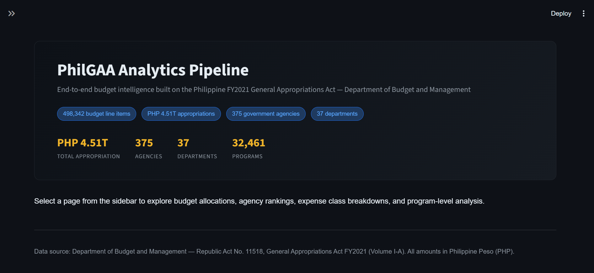

> Hero section with project title, key stats, and data source context.

---

### Overview — KPI Cards and Budget Composition

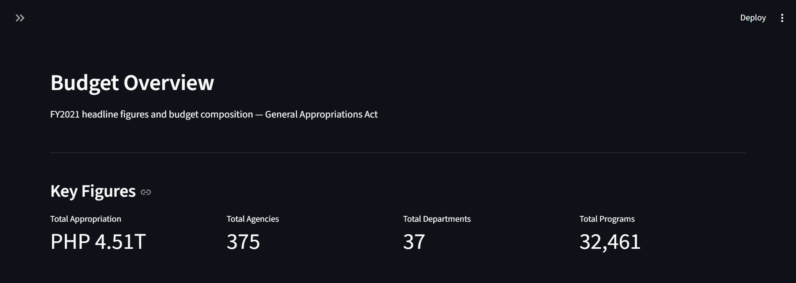
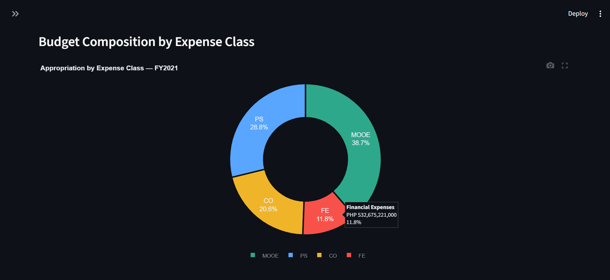
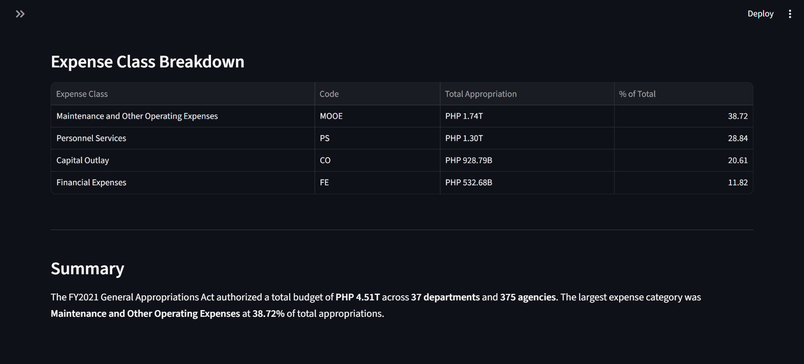

> Four KPI cards showing total appropriation, agencies, departments, and programs. Donut chart showing budget composition by expense class (PS, MOOE, CO, FE).

---

### Agencies — Budget Rankings

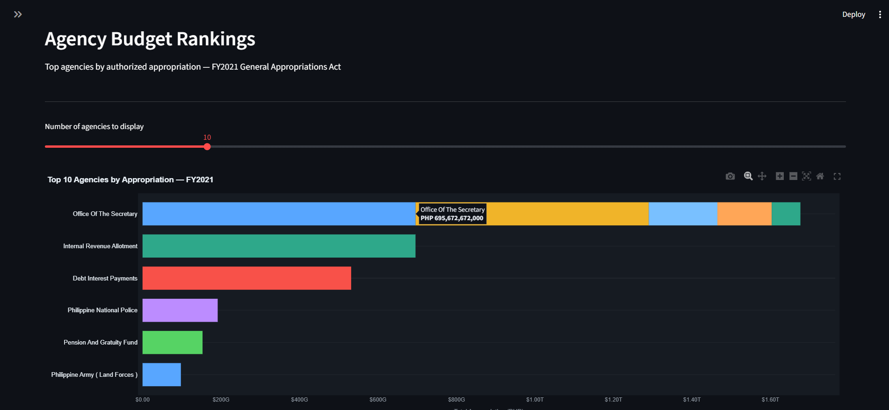
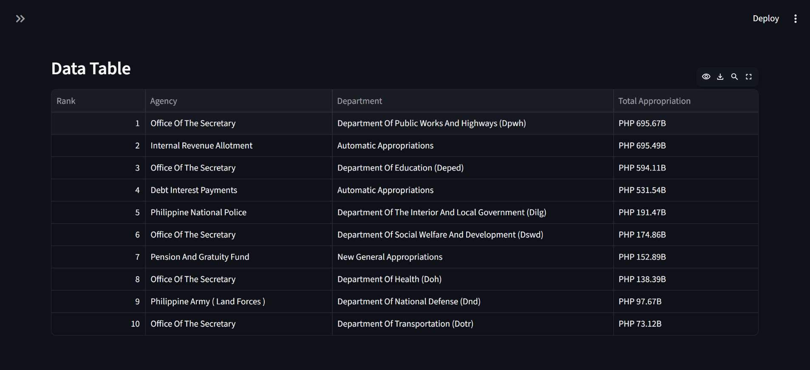

> Interactive horizontal bar chart ranking top agencies by authorized appropriation. Slider controls the number of agencies displayed.

---

### Departments — Budget Distribution

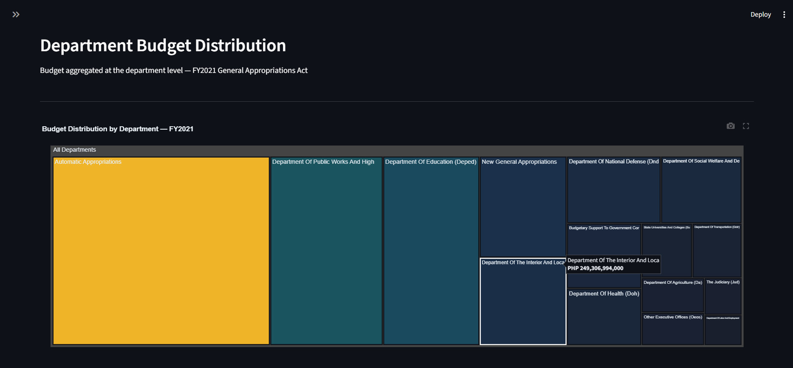
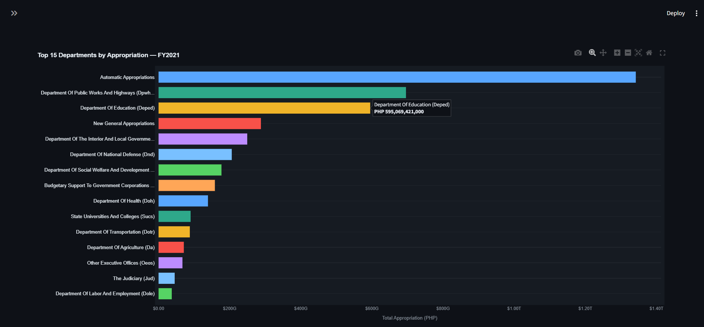
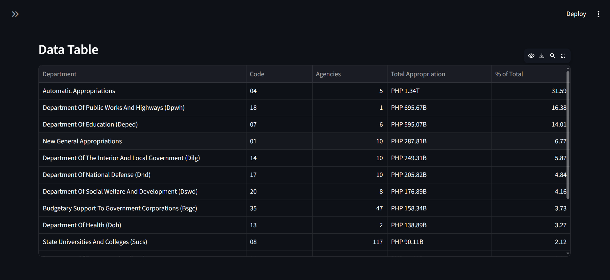

> Treemap and horizontal bar chart showing budget distribution aggregated at the department level. Includes agency count and percentage share per department.

---

### Expense Classes — Breakdown

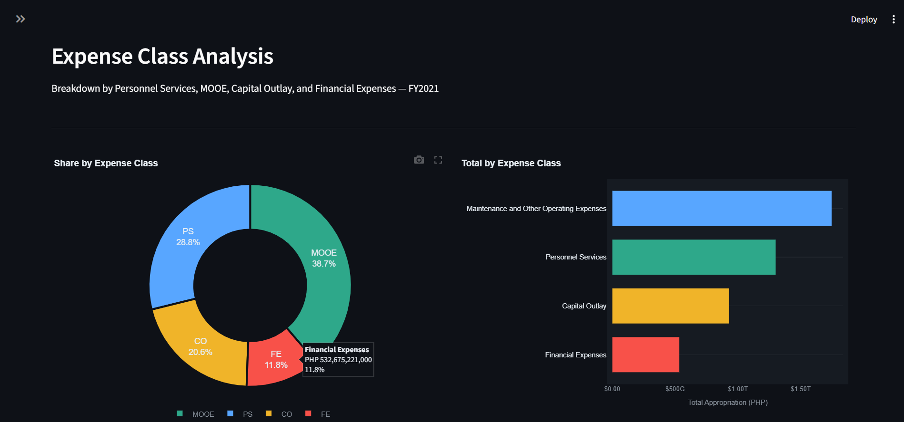
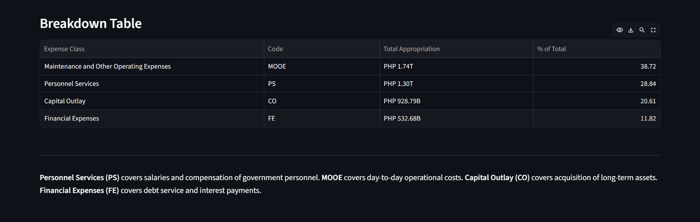

> Side-by-side donut and bar chart breaking down appropriations by Personnel Services, MOOE, Capital Outlay, and Financial Expenses.

---

### Programs — Top by Budget

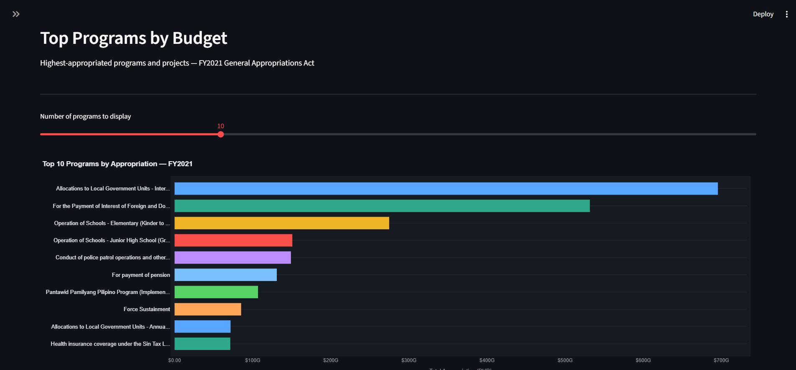
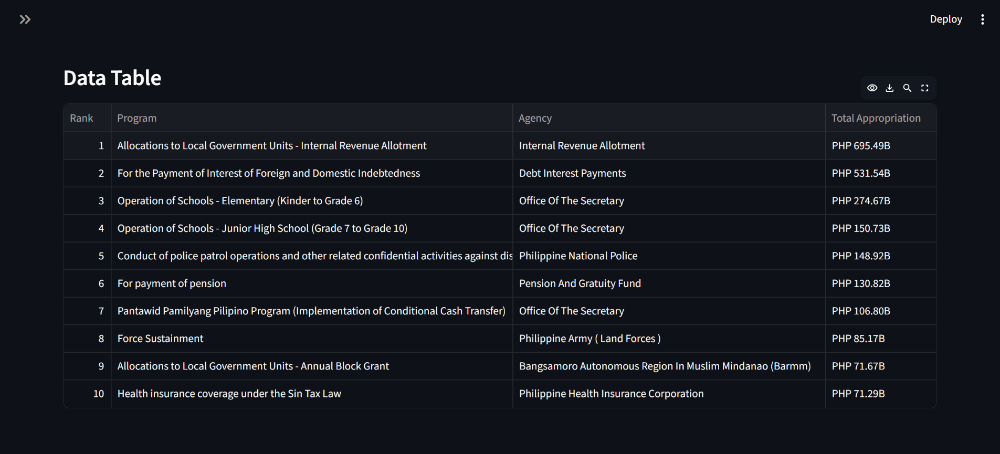

> Top programs by authorized appropriation with parent agency context. Slider controls the number of programs displayed.

---

## Project Overview

PhilGAA Analytics Pipeline transforms raw government appropriations data into an analytics-ready dimensional warehouse and interactive dashboard. The project follows a classic **Extract → Stage → Transform → Model → Serve** architecture that mirrors production data engineering workflows.

The domain is intentionally practical: government budget data is publicly available, structurally complex, and analytically meaningful — making it a stronger portfolio subject than synthetic or toy datasets.

**Key metrics from the FY2021 dataset:**

| Metric | Value |
|---|---|
| Raw rows ingested | 498,342 |
| Total authorized appropriation | PHP 4.506 trillion |
| Government agencies modeled | 375 |
| Departments modeled | 37 |
| Unique programs | 32,461 |
| Expense sub-object codes | 361 |

---

## Data Model

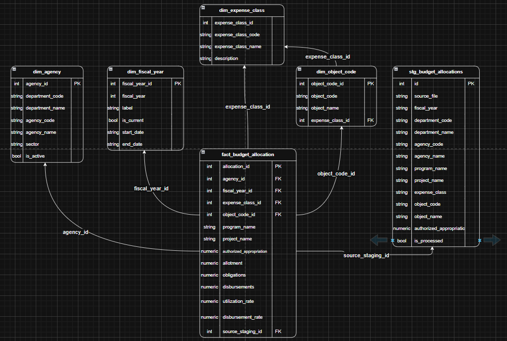

> Kimball-style star schema: four dimension tables surrounding a central fact table. All foreign keys are integer surrogate keys. `source_staging_id` provides full lineage back to the raw staging row.

---

## Architecture

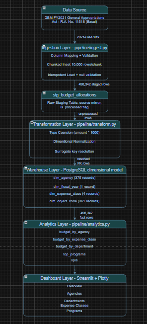

> End-to-end pipeline: raw Excel source → chunked ingestion → staging table → dimensional transformation → PostgreSQL warehouse → analytics module → Streamlit dashboard.

---

## Tech Stack

| Layer | Technology | Purpose |
|---|---|---|
| Language | Python 3.11 | Core ETL and transformation logic |
| Database | PostgreSQL 18 | Primary warehouse storage |
| ORM | SQLAlchemy 2.0 | Schema definition and query execution |
| DB Driver | psycopg2-binary | PostgreSQL adapter |
| Data Processing | Pandas 2.2, NumPy | Cleaning, aggregation, transformation |
| Dashboard | Streamlit 1.35 | Interactive multi-page frontend |
| Visualization | Plotly 5.22 | Charts and visualizations |
| Config | python-dotenv | Environment variable management |
| Excel Parsing | openpyxl | Reading .xlsx source files |
| Version Control | Git | feature branches |

---

## Dataset

**Source:** Department of Budget and Management (DBM), Republic of the Philippines
**Document:** Republic Act No. 11518 — General Appropriations Act FY2021, Volume I-A
**URL:** https://www.dbm.gov.ph/index.php/budget-documents/2021

**What the GAA is:** The General Appropriations Act is the annual law that authorizes the Philippine national government's expenditure program for the fiscal year. It specifies the authorized appropriation for every agency, program, and expense item across all departments.

**What the data contains:** One row per agency-program-expense sub-object combination, with the authorized appropriation amount in thousands of Philippine pesos. The file covers all national government agencies across all 37 departments and 375 agencies.

**What the data does not contain:** Budget execution figures (obligations, disbursements) are published separately by DBM as Budget Execution Reports (BERs). The schema is designed to accommodate execution data when it becomes available — `obligations` and `disbursements` columns exist in the fact table as nullable fields.

---

## Real Data Challenges

This project was built on real government data, not a clean synthetic dataset. The following issues were encountered, diagnosed, and resolved during development — each one is authentic to working with public sector open data.

---

### 1. Truncated Column Name in File Preview

**What happened:** The Excel column preview in the spreadsheet application showed `UACS_AG` as the agency name column header. The ingestion pipeline was built with this mapping and failed validation on the first run.

**Actual column name:** `UACS_AGY_DSC`

**Error:**
```
ValueError: Source file is missing required columns: {'UACS_AG'}
Found columns: ['DEPARTMENT', 'UACS_DPT_DSC', 'AGENCY', 'UACS_AGY_DSC', ...]
```

**Resolution:** Diagnosed by reading the actual column list from the validation error output. Updated `COLUMN_MAP` in `pipeline/ingest.py` with the correct header. Added a comment noting the truncation for future maintainers.

**Lesson:** Never assume column names from a visual preview. Always validate against the actual file headers programmatically.

---

### 2. Amounts Denominated in Thousands of Pesos

**What happened:** Row 1 of the Excel file contained the note `(In Thousand Pesos)` — not a header row, but a unit annotation. All `AMT` values in the file represent thousands of pesos, not actual pesos.

**Impact:** Without conversion, PHP 695 billion would be stored as PHP 695 million — a 1,000x error in all financial figures.

**Resolution:** Applied in `pipeline/transform.py` during the cleaning step:

```python
df["authorized_appropriation"] = pd.to_numeric(
    df["authorized_appropriation"], errors="coerce"
)
df["authorized_appropriation"] = df["authorized_appropriation"] * 1000
```

Conversion is intentionally applied in the transformation layer, not ingestion — the staging table preserves the source values exactly as they appear in the file.

**Verification:** Total appropriation after conversion: PHP 4.506 trillion — consistent with publicly reported FY2021 national budget figures.

---

### 3. Null Amounts on 3,206 Rows (0.64%)

**What happened:** Post-load validation revealed 3,206 rows with no `AMT` value — approximately 0.64% of all rows.

**Root cause:** These rows correspond to program description entries and subtotal markers in the GAA structure that carry no direct peso appropriation value. They serve as organizational labels in the source document.

**Resolution:** Flagged rather than dropped. An `has_null_amount` flag was added during transformation and null amounts were set to zero. This preserves all rows in the staging table for lineage and audit purposes while preventing null propagation in the fact table.

```python
df["has_null_amount"] = df["authorized_appropriation"].isna()
df["authorized_appropriation"] = df["authorized_appropriation"].fillna(0)
```

**Lesson:** Never silently drop null rows without understanding why they exist. In government data, nulls often have structural explanations.

---

### 4. Expense Class Stored as Numeric Codes

**What happened:** The `UACS_EXP_CD` column — expected to contain UACS expense class identifiers — contained simple numeric codes (`1`, `2`, `3`, `6`) instead of the expected string codes (`PS`, `MOOE`, `CO`, `FE`) or UACS prefix strings (`5010...`).

**Impact:** The initial prefix-based mapping logic produced zero matches, leaving all 361 object code records with null `expense_class_id`. The expense class breakdown query returned zero rows.

**Diagnosis:** Inspected the staging table directly in psql:

```sql
SELECT DISTINCT expense_class FROM stg_budget_allocations LIMIT 20;
-- Result: 1, 2, 3, 6
```

**Resolution:** Replaced the prefix map with a direct numeric code map:

```python
EXPENSE_CLASS_CODE_MAP = {
    "1": "PS",    # Personnel Services
    "2": "MOOE",  # Maintenance and Other Operating Expenses
    "3": "FE",    # Financial Expenses
    "6": "CO",    # Capital Outlay
}
```

**Lesson:** Always inspect actual column values before writing mapping logic. Documentation and column names do not always match what the data contains.

---

### 5. Pandas Float Upcast on Nullable Integer Foreign Keys

**What happened:** After resolving surrogate keys via `.map()`, integer FK columns (`object_code_id`, `expense_class_id`, `source_staging_id`) were silently upcast to `float64` by pandas — because `.map()` on a Series containing any `NaN` values promotes the dtype automatically. PostgreSQL's `INTEGER` type does not accept float values.

**Error:**
```
psycopg2.errors.NumericValueOutOfRange: integer out of range
[parameters: {'object_code_id__0': 1.0, 'expense_class_id__0': 1.0, ...}]
```

**Resolution:** Used pandas nullable integer dtype (`Int64` with capital I) which holds `NaN` without float promotion:

```python
for col in ["object_code_id", "expense_class_id", "source_staging_id"]:
    fact_df[col] = pd.array(
        pd.to_numeric(fact_df[col], errors="coerce"),
        dtype="Int64"
    )
```

**Lesson:** Pandas `int64` and `Int64` behave differently. Lowercase `int64` cannot hold NaN and will upcast to float. Uppercase `Int64` is the nullable integer extension type.

---

### 6. PostgreSQL 15+ Public Schema Permissions

**What happened:** Schema initialization failed with a permissions error when creating tables under `budget_user`.

**Error:**
```
psycopg2.errors.InsufficientPrivilege: permission denied for schema public
```

**Root cause:** PostgreSQL 15 revoked the default `CREATE` privilege on the public schema that all users had in earlier versions. This is a known breaking change introduced as a security hardening measure.

**Resolution:**
```sql
GRANT ALL ON SCHEMA public TO budget_user;
GRANT ALL PRIVILEGES ON DATABASE ph_gov_budget TO budget_user;
ALTER DATABASE ph_gov_budget OWNER TO budget_user;
```

**Lesson:** PostgreSQL version matters. Behavior that works on PostgreSQL 14 may break on 15+. Always check release notes when upgrading or setting up on a new version.

---

### 7. Structural GAA Data Quirk — "Office Of The Secretary" as Top Agency

**What happened:** The top agency by appropriation is consistently "Office Of The Secretary" across multiple departments — DPWH, DepEd, DOH — rather than the department names themselves.

**Root cause:** This is authentic GAA structure, not a pipeline error. Philippine government agencies consolidate their entire budget allocation under the Office of the Secretary as the parent organizational unit, rather than distributing it across individual bureaus or offices in the appropriations document.

**Impact on analytics:** Department-level aggregation (`budget_by_department`) gives a more accurate picture of sectoral spending than agency-level queries. This is documented in the dashboard under each relevant page.

---

## Project Structure

```
philgaa-analytics-pipeline/
│
├── .env                        # DB credentials — never committed
├── .gitignore
├── README.md
├── requirements.txt
├── pyproject.toml              # Editable install for module resolution
│
├── data/
│   ├── raw/                    # Original source files — gitignored
│   └── processed/              # Intermediate cache — gitignored
│
├── docs/
│   └── images/
│       ├── architecture.png    # Pipeline architecture diagram
│       ├── data_model.png      # ERD / dimensional model diagram
│       └── screenshots/        # Dashboard page screenshots
│           ├── 01_landing.png
│           ├── 02_overview.png
│           ├── 03_agencies.png
│           ├── 04_departments.png
│           ├── 05_expense_classes.png
│           └── 06_programs.png
│
├── pipeline/
│   ├── __init__.py
│   ├── ingest.py               # Raw file ingestion into staging
│   ├── transform.py            # ETL, normalization, dimensional load
│   └── analytics.py            # Reusable query functions
│
├── db/
│   ├── __init__.py
│   ├── connection.py           # SQLAlchemy engine and session factory
│   ├── schema.py               # All table definitions via ORM
│   └── schema_init.py          # Table creation and static seed data
│
├── dashboard/
│   ├── app.py                  # Streamlit entry point and global styles
│   ├── utils/
│   │   ├── __init__.py
│   │   ├── formatters.py       # Peso formatting and label helpers
│   │   └── charts.py           # Reusable Plotly chart functions
│   └── pages/
│       ├── 1_Overview.py
│       ├── 2_Agencies.py
│       ├── 3_Departments.py
│       ├── 4_Expense_Classes.py
│       └── 5_Programs.py
│
├── scripts/
│   ├── run_pipeline.py         # Orchestrates full ingestion + transformation
│   └── test_analytics.py       # Smoke test for all analytics functions
│
└── tests/
    ├── test_ingest.py
    └── test_transform.py
```

---

## Getting Started

### Prerequisites

- Python 3.11+
- PostgreSQL 15 or 18
- Git

### 1. Clone the Repository

```bash
git clone https://github.com/credough/philgaa-analytics-pipeline.git
cd philgaa-analytics-pipeline
```

### 2. Create and Activate Virtual Environment

```bash
python -m venv venv

# macOS / Linux
source venv/bin/activate

# Windows
venv\Scripts\activate
```

### 3. Install Dependencies

```bash
pip install -r requirements.txt
pip install -e .
```

### 4. Create the PostgreSQL Database

```bash
psql -U postgres
```

```sql
CREATE DATABASE ph_gov_budget;
CREATE USER budget_user WITH ENCRYPTED PASSWORD 'your_password_here';
GRANT ALL ON SCHEMA public TO budget_user;
GRANT ALL PRIVILEGES ON DATABASE ph_gov_budget TO budget_user;
ALTER DATABASE ph_gov_budget OWNER TO budget_user;
\q
```

### 5. Configure Environment Variables

Create a `.env` file in the project root:

```env
DB_HOST=localhost
DB_PORT=5432
DB_NAME=ph_gov_budget
DB_USER=budget_user
DB_PASSWORD=your_password_here
```

### 6. Initialize the Database Schema

```bash
python -m db.schema_init
```

Expected output:
```
Database connection verified.
Creating tables...
Schema initialized successfully.
Static dimension data seeded.
```

### 7. Download the Source Data

Download the FY2021 GAA Excel file from the DBM website:

```
https://www.dbm.gov.ph/index.php/budget-documents/2021
```

Rename the file to `2021-GAA.xlsx` and place it in `data/raw/`:

```
data/
└── raw/
    └── 2021-GAA.xlsx
```

### 8. Run the Pipeline

```bash
python -m scripts.run_pipeline
```

Expected output:
```
Reading file: 2021-GAA.xlsx
Fiscal year: 2021
Raw rows read: 498,342
  Chunk 50/50: 498,342 rows inserted
Ingestion complete: 498,342 rows inserted.

Validation Report:
  total_rows: 498342
  null_agency_name: 0
  null_amt: 3206
  null_amt_pct: 0.64

--- Starting transformation for: 2021-GAA.xlsx ---
Unique agencies found: 375
Agency dimension records: 375
Unique object codes found: 361
Fact rows inserted: 498,342
--- Transformation complete ---
```

### 9. Launch the Dashboard

```bash
streamlit run dashboard/app.py
```

Navigate to `http://localhost:8501`

---

## Pipeline Walkthrough

### Ingestion (`pipeline/ingest.py`)

Reads the raw GAA Excel file, validates that all required columns are present, strips whitespace, replaces empty strings with NULL, adds pipeline metadata (`source_file`, `fiscal_year`, `is_processed`), and inserts rows into `stg_budget_allocations` in chunks of 10,000 rows. The staging table is a column-for-column mirror of the source file with no transformations applied.

Idempotency is enforced by deleting all existing rows for the source file before each load — re-running the pipeline produces identical results.

### Transformation (`pipeline/transform.py`)

Loads unprocessed staging rows, applies type coercion (string to numeric), converts amounts from thousands to actual pesos, standardizes text fields (uppercase codes, title-case names), maps expense class numeric codes to surrogate keys, resolves all dimensional foreign keys, and inserts into the fact table. Staging rows are marked `is_processed = TRUE` on completion.

### Analytics (`pipeline/analytics.py`)

Five parameterized query functions return pandas DataFrames. All functions accept `fiscal_year` as a parameter for forward compatibility with additional years of data. A central `_query` helper handles all SQL execution.

---


## Analytics and Dashboard

### Analytics Module

| Function | Description | Key Parameters |
|---|---|---|
| `total_budget_by_agency` | Top N agencies by appropriation with window-function rank | `fiscal_year`, `top_n` |
| `budget_by_expense_class` | PS/MOOE/CO/FE breakdown with percentage share | `fiscal_year` |
| `budget_by_department` | Department-level aggregation with agency count | `fiscal_year`, `top_n` |
| `top_programs_by_budget` | Top N programs with parent agency context | `fiscal_year`, `top_n` |
| `budget_summary_kpis` | Headline KPI dict composing results from other functions | `fiscal_year` |

### Dashboard Pages

| Page | Chart Types | Interactive Controls |
|---|---|---|
| Overview | KPI cards, donut chart | None |
| Agencies | Horizontal bar chart, data table | Top N slider (5–30) |
| Departments | Treemap, horizontal bar chart, data table | None |
| Expense Classes | Donut chart, horizontal bar chart, data table | None |
| Programs | Horizontal bar chart, data table | Top N slider (5–25) |

---

## Key Results

**Total FY2021 Authorized Appropriation: PHP 4.506 trillion**

Budget breakdown by expense class:

| Expense Class | Total (PHP) | Share |
|---|---|---|
| Maintenance and Other Operating Expenses | 1.74 trillion | 38.7% |
| Personnel Services | 1.30 trillion | 28.8% |
| Capital Outlay | 928.8 billion | 20.6% |
| Financial Expenses | 532.7 billion | 11.8% |

Top 5 agencies by appropriation:

| Rank | Agency | Department | Appropriation |
|---|---|---|---|
| 1 | Office Of The Secretary | DPWH | PHP 695.67B |
| 2 | Internal Revenue Allotment | Automatic Appropriations | PHP 695.49B |
| 3 | Office Of The Secretary | DepEd | PHP 594.11B |
| 4 | Debt Interest Payments | Automatic Appropriations | PHP 531.54B |
| 5 | Philippine National Police | DILG | PHP 191.47B |

---

## What This Demonstrates

| Skill | Implementation |
|---|---|
| Data ingestion engineering | Chunked insert, structural validation, idempotent staging |
| Data quality management | Null flagging, type coercion, source value preservation |
| Dimensional modeling | Kimball fact/dimension schema, surrogate keys, foreign key integrity |
| ETL pipeline design | Staged transformation, pipeline state tracking, lineage columns |
| Analytical SQL | Window functions, multi-table joins, aggregation across 498K rows |
| Python data engineering | Pandas, SQLAlchemy ORM, psycopg2, environment management |
| Data product delivery | Streamlit multi-page dashboard, Plotly interactive charts |
| Real data problem solving | Six documented data issues diagnosed and resolved on live data |

---

## Future Improvements

- Add FY2022 and FY2023 GAA data to enable year-over-year appropriation trend analysis
- Ingest DBM Budget Execution Reports to populate `obligations` and `disbursements` columns and compute actual `utilization_rate` and `disbursement_rate`
- Add PhilGEPS procurement contract data as a second fact table for procurement analytics
- Implement a full test suite covering ingestion validation, transformation logic, and analytics query output
- Add Docker Compose for one-command local deployment of PostgreSQL and the Streamlit dashboard
- Schedule pipeline runs with Apache Airflow or Prefect for automated data refresh

---

## License

MIT License. See `LICENSE` for details.

---

*Data source: Department of Budget and Management, Republic of the Philippines.
Republic Act No. 11518 — General Appropriations Act FY2021, Volume I-A.
All financial figures in Philippine Peso (PHP).*

---

## Introduction

The Philippine government publishes its annual budget through the
General Appropriations Act (GAA) — a legislative document that
authorizes every peso the national government is authorized to
spend across all departments, agencies, programs, and projects
for a given fiscal year. While the data is technically public,
it exists in a form that is difficult for most people to read,
query, or analyze: a multi-hundred-thousand-row Excel file with
encoded column names, numeric classification codes, and amounts
denominated in thousands of pesos.

This project — PhilGAA Analytics Pipeline — was built to bridge
that gap. Starting from the raw FY2021 GAA Excel file published
by the Department of Budget and Management (DBM), the pipeline
ingests, cleans, models, and visualizes the full national budget
in a form that is queryable, explorable, and analytically
meaningful.

The FY2021 fiscal year was chosen as the initial scope because
it represents a critical period in Philippine fiscal history —
the first full budget cycle during the COVID-19 pandemic response,
characterized by significant realignments toward health, social
protection, and economic recovery programs alongside continued
infrastructure spending commitments.

---

## Problem Statement

The Philippine government's budget data is publicly available
but not publicly accessible in a practical sense. The raw GAA
file presents several barriers to meaningful analysis:

- Budget line items are granular to the sub-object level,
  producing hundreds of thousands of rows that cannot be
  meaningfully interpreted without aggregation and modeling
- Financial amounts are denominated in thousands of pesos
  without consistent labeling, creating a risk of 1,000x
  misinterpretation for anyone working with the raw file
- Expense classifications are stored as numeric codes with
  no lookup reference in the file itself
- There is no structured, queryable version of the data
  available through official government channels — only
  the raw Excel download

As a result, questions that should be straightforward —
which agencies received the most funding, how the budget
is distributed across expense types, which programs
command the largest appropriations — require significant
data engineering work before they can be answered.

This project addresses that problem by building the
infrastructure needed to make the GAA data analytically
accessible.

---

## Objectives

The project was guided by the following analytical objectives:

**Primary objectives:**

1. Ingest and structure the full FY2021 GAA dataset into a
   queryable relational database without loss of source fidelity
2. Identify the distribution of the national budget across
   government agencies, departments, and expense classifications
3. Surface the top-funded programs and projects in the FY2021
   appropriations
4. Deliver findings through an interactive dashboard accessible
   to non-technical audiences

**Secondary objectives:**

5. Document real data quality issues encountered in the source
   file and the resolutions applied — contributing to public
   knowledge about working with Philippine government open data
6. Design a schema extensible enough to accommodate budget
   execution data (obligations and disbursements) when it
   becomes available, enabling future utilization rate analysis

---

## Dataset Description

| Attribute | Detail |
|---|---|
| Source | Department of Budget and Management (DBM) |
| Document | Republic Act No. 11518 — General Appropriations Act FY2021, Volume I-A |
| File format | Microsoft Excel (.xlsx) |
| Sheet | 2021 GAA (single sheet) |
| Row count | 498,342 (excluding header rows) |
| Column count | 16 |
| Amount denomination | Thousands of Philippine Peso (PHP) |
| Fiscal year covered | January 1 – December 31, 2021 |

**Key columns in the source file:**

| Source Column | Description | Maps To |
|---|---|---|
| DEPARTMENT | Department numeric code | department_code |
| UACS_DPT_DSC | Department name | department_name |
| AGENCY | Agency numeric code | agency_code |
| UACS_AGY_DSC | Agency name | agency_name |
| PREXC_FPAP_ID | Program/project identifier | program_name |
| DSC | Program/project description | project_name |
| UACS_EXP_CD | Expense class code (numeric) | expense_class |
| UACS_SOBJ_CD | Sub-object code | object_code |
| UACS_SOBJ_DSC | Sub-object description | object_name |
| AMT | Authorized appropriation in thousands PHP | authorized_appropriation |

**Columns intentionally excluded from the pipeline:**

| Column | Reason for Exclusion |
|---|---|
| OPERUNIT | Operating unit — too granular for department/agency analysis |
| UACS_OPER_DSC | Operating unit description — same reason |
| UACS_REG_ID | Regional identifier — out of scope for this iteration |
| FUNDCD | Fund code — out of scope for this iteration |
| UACS_FUNDSUBCAT_DSC | Fund subcategory — out of scope for this iteration |

---

## Methodology

The project followed a five-stage data pipeline methodology
modeled after standard data warehouse engineering practice:

**Stage 1 — Extraction and Staging**
The raw GAA Excel file was read using pandas with `openpyxl`
as the parsing engine. The file header is on row 2 (row 1
contains the unit annotation "In Thousand Pesos"), requiring
`header=1` in the read call. All columns were initially read
as strings to prevent pandas from applying automatic type
inference on financial and code columns. Selected columns
were mapped to staging table names and inserted into
`stg_budget_allocations` in PostgreSQL via SQLAlchemy using
chunked bulk inserts of 10,000 rows per batch.

**Stage 2 — Cleaning and Transformation**
Staged rows were processed through a cleaning pipeline that
applied type coercion, amount conversion, string standardization,
and null flagging. The `is_processed` flag on the staging table
was used as a pipeline state marker to enable re-runnable
transformations without row duplication.

**Stage 3 — Dimensional Modeling**
Unique agency, expense class, and object code combinations
were extracted from the cleaned data and loaded into dimension
tables with auto-generated integer surrogate keys. Foreign key
references were resolved before fact table insertion using
in-memory Python dictionaries built from the dimension table
records.

**Stage 4 — Analytics**
Five parameterized query functions were written against the
dimensional model, returning pandas DataFrames for consumption
by the dashboard layer. All functions accept `fiscal_year` as
a parameter for forward compatibility with future year data.

**Stage 5 — Visualization**
An interactive multi-page Streamlit dashboard was built on
top of the analytics module. Plotly was used for all chart
rendering. The dashboard follows a dark theme with a
Blue-Teal-Amber color palette where colors encode meaning —
blue for Personnel Services, teal for MOOE, amber for Capital
Outlay, and red for Financial Expenses.

---

## Data Cleaning Process

The following cleaning operations were applied in
`pipeline/transform.py` after loading staged rows:

**1. Type coercion**
The `authorized_appropriation` column was read as a string
at ingestion and converted to numeric during transformation:

```python
df["authorized_appropriation"] = pd.to_numeric(
    df["authorized_appropriation"], errors="coerce"
)
```

The `errors="coerce"` parameter converts unparseable values
to NaN rather than raising an exception, preserving all rows
for downstream null handling.

**2. Amount conversion**
All amounts in the source file are denominated in thousands
of pesos. Conversion to actual peso values was applied:

```python
df["authorized_appropriation"] = df["authorized_appropriation"] * 1000
```

This conversion is applied in the transformation layer rather
than ingestion, preserving the source values in the staging
table as a faithful mirror of the original file.

**3. Null amount handling**
3,206 rows (0.64% of total) had no AMT value. These correspond
to program description rows and subtotal markers in the GAA
structure. Rather than dropping them, a flag was added and
amounts were set to zero:

```python
df["has_null_amount"] = df["authorized_appropriation"].isna()
df["authorized_appropriation"] = df["authorized_appropriation"].fillna(0)
```

**4. String standardization**
- Code columns (department_code, agency_code, object_code,
  expense_class): stripped of whitespace and uppercased
- Name columns (agency_name, department_name): stripped of
  whitespace and converted to title case
- Empty strings replaced with NULL across all string columns

**5. Expense class mapping**
The `UACS_EXP_CD` column contained numeric codes rather than
the expected expense class labels. The mapping was determined
by cross-referencing object codes against known UACS
classifications:

```python
EXPENSE_CLASS_CODE_MAP = {
    "1": "PS",    # Personnel Services
    "2": "MOOE",  # Maintenance and Other Operating Expenses
    "3": "FE",    # Financial Expenses
    "6": "CO",    # Capital Outlay
}
```

**6. Nullable integer foreign key casting**
Pandas `.map()` on columns containing NaN values silently
upcasts to `float64`, which PostgreSQL's INTEGER type rejects.
Nullable integer dtype was applied to all FK columns:

```python
for col in ["object_code_id", "expense_class_id", "source_staging_id"]:
    fact_df[col] = pd.array(
        pd.to_numeric(fact_df[col], errors="coerce"),
        dtype="Int64"
    )
```

---

## Data Analysis and Computations

All analytics were computed by querying the dimensional model
in PostgreSQL via SQLAlchemy. The following analytical
computations were performed:

**Total budget by agency**
Aggregated `authorized_appropriation` from `fact_budget_allocation`
grouped by `agency_id`, joined to `dim_agency` for agency names.
Window function `RANK()` was applied over the aggregated totals
to produce ranked output:

```sql
RANK() OVER (ORDER BY SUM(f.authorized_appropriation) DESC)
```

**Budget by expense class**
Aggregated appropriations joined through `dim_object_code` to
`dim_expense_class` to resolve the PS/MOOE/CO/FE classification.
Percentage share was computed in Python after retrieval:

```python
df["pct_of_total"] = (df["total_appropriation"] / total * 100).round(2)
```

**Budget by department**
Aggregated at the department level above the agency grain,
with `COUNT(DISTINCT agency_id)` to show the number of agencies
per department. Percentage share computed in Python.

**Top programs by budget**
Aggregated by `project_name` with parent agency context,
filtered to exclude null program names, ranked by total
appropriation descending.

**KPI summary**
Composite function drawing from the four analytics functions
above to produce a single dictionary of headline figures:
total appropriation, total agencies, total departments,
total programs, largest agency, and dominant expense class.

---

## Visualizations

The dashboard delivers five pages of interactive visualizations:

**Overview page**
Four KPI metric cards display the headline figures: total
appropriation (PHP 4.51T), total agencies (375), total
departments (37), and total programs (32,461). A donut chart
shows the proportional breakdown of the budget by expense
class using semantic colors.

**Agencies page**
A horizontal bar chart ranks agencies by total authorized
appropriation. An interactive slider allows the viewer to
control how many agencies are displayed (5 to 30). A data
table below the chart shows the full ranked list with
formatted peso values.

**Departments page**
A treemap visualizes the budget distribution across
departments using a blue-to-amber color gradient encoding
relative budget size — larger departments render in warmer
tones. A horizontal bar chart provides a ranked alternative
view. Both are accompanied by a data table with agency count
and percentage share per department.

**Expense Classes page**
A donut chart and horizontal bar chart are displayed
side-by-side. The donut uses semantic colors — blue for PS,
teal for MOOE, amber for CO, red for FE — so the color
itself communicates the expense type without requiring
a legend lookup. A definitions block explains each
expense class in plain language.

**Programs page**
A horizontal bar chart ranks the top N programs by
authorized appropriation with parent agency context.
An interactive slider controls the display count (5 to 25).
Long program names are truncated in the chart and shown
in full in the accompanying data table.

---

## Findings and Insights

**Finding 1 — The national budget is dominated by operational spending**

At 38.7% of total appropriations, Maintenance and Other
Operating Expenses (MOOE) is the single largest expense
class in the FY2021 budget — larger than even Personnel
Services at 28.8%. This reflects the operational scale
of the Philippine government's service delivery programs,
particularly in health and education where day-to-day
operational costs exceed payroll.

**Finding 2 — Infrastructure and debt service together consume nearly a third of the budget**

Capital Outlay (20.6%) and Financial Expenses (11.8%)
combined account for 32.4% of total appropriations —
PHP 1.46 trillion. Financial Expenses at PHP 532.7 billion
reflects the Philippines' significant debt service
obligations in 2021, a consequence of pandemic-era
borrowing to finance emergency response programs.

**Finding 3 — DPWH and DepEd are the two largest agency-level budget recipients**

The Department of Public Works and Highways received
PHP 695.67 billion — the largest single agency appropriation
in FY2021 — reflecting the administration's infrastructure
agenda. The Department of Education follows at PHP 594.11
billion, consistent with the constitutional mandate to
allocate the largest share of the national budget to education.

**Finding 4 — Automatic appropriations account for a significant share of total spending**

The Internal Revenue Allotment to local government units
(PHP 695.49 billion) and Debt Interest Payments (PHP 531.54
billion) appear among the top five agency-level appropriations
as "Automatic Appropriations" — budget items mandated by law
that do not require annual congressional deliberation. Together
they represent PHP 1.23 trillion or approximately 27% of the
total budget, limiting the discretionary portion available
for program reallocation.

**Finding 5 — The budget is distributed across 32,461 distinct programs**

The granularity of the GAA at the sub-object and program
level means that aggregated agency and department figures
obscure significant internal variation. A single department
like DPWH or DepEd contains hundreds of distinct program
line items ranging from central office operations to
regional infrastructure projects.

---

## Conclusion

The FY2021 Philippine General Appropriations Act authorizes
PHP 4.506 trillion in national government spending across
375 agencies, 37 departments, and 32,461 programs. The
largest expense category is MOOE at 38.7%, followed by
Personnel Services at 28.8%, Capital Outlay at 20.6%,
and Financial Expenses at 11.8%.

The data confirms well-known fiscal priorities — DPWH and
DepEd as the dominant agency-level recipients, significant
automatic appropriations for IRA and debt service — while
also surfacing the operational scale of government spending
that is less visible in high-level budget summaries.

The pipeline and dashboard built for this project demonstrate
that meaningful budget analysis is achievable from publicly
available data, given the right data engineering and
analytical infrastructure. The schema is designed to extend
to budget execution data when it becomes available, at which
point utilization and disbursement rate analysis will be
possible — enabling comparison of what was appropriated
against what was actually spent.

---

## Recommendations

Based on the findings and the analytical gaps identified
during this project, the following are recommended as
extensions and areas for further analysis:

**1. Integrate budget execution data**
The DBM publishes Budget Execution Reports (BERs) containing
obligations and disbursements by agency. Integrating this
data into the existing schema would enable utilization rate
analysis — comparing authorized appropriations against actual
spending — which is the most analytically meaningful question
for accountability purposes.

**2. Extend to multiple fiscal years**
Adding FY2022 and FY2023 GAA data would enable year-over-year
trend analysis, revealing how budget priorities shifted across
the pandemic recovery period and into the new administration.
The pipeline is designed to support multiple fiscal years
with no schema changes required.

**3. Add procurement contract data**
The Philippine Government Electronic Procurement System
(PhilGEPS) publishes awarded contract data that can be
linked to budget line items by agency. This would enable
analysis of how budget appropriations translate into actual
procurement activity — a key dimension of public finance
accountability.

**4. Publish as an open analytical resource**
The dashboard and underlying data model could be deployed
as a publicly accessible resource for journalists,
researchers, and civil society organizations working on
budget transparency and accountability in the Philippines.

---

## References

- Department of Budget and Management. (2021). *Republic Act
  No. 11518 — General Appropriations Act FY2021, Volume I-A*.
  Retrieved from https://www.dbm.gov.ph/index.php/budget-documents/2021

- Congressional Policy and Budget Research Department. (2021).
  *2021 Budget Briefer: Dimensions of the 2021 National
  Government Budget*. Retrieved from
  https://cpbrd.congress.gov.ph/wp-content/uploads/2023/09/BB2021-02_Dimensions_of_the_2021_NG_Budget.pdf

- Department of Budget and Management. (2021). *Unified
  Accounts Code Structure (UACS) Manual*. Retrieved from
  https://www.dbm.gov.ph

- Kimball, R., & Ross, M. (2013). *The Data Warehouse
  Toolkit: The Definitive Guide to Dimensional Modeling*
  (3rd ed.). John Wiley & Sons.

- pandas Development Team. (2024). *pandas documentation —
  Nullable integer data type*. Retrieved from
  https://pandas.pydata.org/docs/user_guide/integer_na.html

- PostgreSQL Global Development Group. (2023). *PostgreSQL 15
  Release Notes — Changes to public schema privileges*.
  Retrieved from https://www.postgresql.org/docs/15/release-15.html
